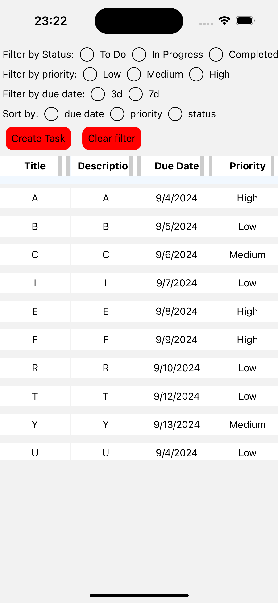

# Getting Started

> **Note**: Make sure you have completed the [React Native - Environment Setup](https://reactnative.dev/docs/environment-setup) instructions till "Creating a new application" step, before proceeding.

## Run the app

Environment: Node.js >=18.20

```bash
yarn clean
yarn ios
yarn android
```

Testing:

```bash
yarn test
```

If everything is set up _correctly_, you should see your app like this:



## Information

### Features:

- **Rearrangement & Resize**: Apply Rearrangement & Resize animations to column (first line for rearranging and second line for resizing).
- **Task Filtering**: Filter tasks by status (completed, in progress), priority (high, medium, low), and due date ranges.
- **Pagination**: Efficiently load more tasks as you scroll down, ensuring optimal performance for large task lists.
- **Task Sorting**: Sort tasks based on attributes such as due date, priority, or status.
- **Task Creation and Editing**: Add or edit tasks, including their title, description, status, priority, due date and image.
- **Task Navigation**: Easily navigate between the task list and individual task details with React Navigation.

### Libraries Used:

- **react-navigation**: Handles navigation between screens.
- **redux & redux-toolkit**: Manages global state.
- **redux-persist**: Store redux state to mobile's storage
- **jest**: Unit Test.
- **react-native-gesture-handler**: Detect gesture.
- **react-native-reanimated**: Make smoothly animations.
- **react-native-image-picker**: Select image from library.

## Details

1. The source code includes two versions of the task manager: one that filters based on the original dataset and another that filters using Map structures.
   
    **Using Map**:
   - **_Pros_**: Fast lookups (O(1)), better scalability for large datasets.
   - **_Cons_**: Map creation takes (O(n)), higher memory usage, more complexity.
     
    **Using filter()**:
   - **_Pros_**: Low memory usage, simpler implementation
   - **_Cons_**: Slow lookups, suitable for small datasets.

3. The app has two animations: one for rearranging items and another for resizing columns. However, there is a bug with the resizing animation: when resizing any column, the other columns do not adjust to fill the empty space. (Apologies, I didn't have enough time to resolve this issue.)
